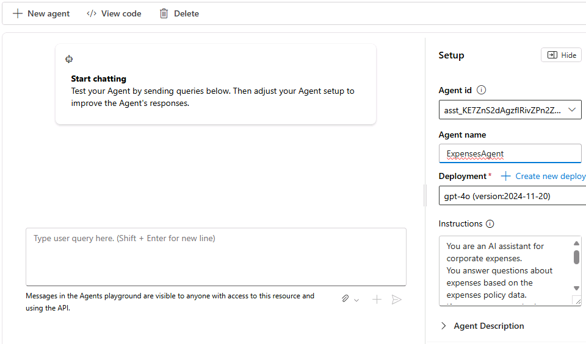

---
lab:
  title: Explore o desenvolvimento do agente de I
  description: Dê os primeiros passos no desenvolvimento de agentes de IA explorando as ferramentas de serviço do Agente de IA do Azure no Portal da Fábrica de IA do Azure.
---

# Explore o desenvolvimento do agente de I

Neste exercício, você usa as ferramentas de serviço do Agente de IA do Azure no Portal da Fábrica de IA do Azure para criar um agente de IA simples que responde a perguntas sobre solicitações de despesas.

Este exercício levará aproximadamente **30** minutos.

> **Observação**: algumas das tecnologias usadas neste exercício estão em versão prévia ou em desenvolvimento ativo. Você pode observar algum comportamento, avisos ou erros inesperados.

## Criar um projeto do Azure AI Foundry

Vamos começar criando um projeto da Fábrica de IA do Azure.

1. Em um navegador da Web, abra o [Portal da Fábrica de IA do Azure](https://ai.azure.com) em `https://ai.azure.com` e entre usando suas credenciais do Azure. Feche todas as dicas ou painéis de início rápido abertos na primeira vez que você entrar e, se necessário, use o logotipo da **Fábrica de IA do Azure** no canto superior esquerdo para navegar até a home page, que é semelhante à imagem a seguir (feche o painel **Ajuda** se estiver aberto):

    

1. Na home page, selecione **+Criar projeto**.
1. No assistente **Criar um projeto**, insira um nome de projeto adequado e, se um hub existente for sugerido, escolha a opção de criar um novo. Em seguida, examine os recursos do Azure que serão criados automaticamente para dar suporte ao hub e ao projeto.
1. Selecione **Personalizar** e especifique as seguintes configurações para o hub:
    - **Nome do hub**: *um nome válido para o seu hub*
    - **Assinatura**: *sua assinatura do Azure*
    - **Grupo de recursos**: *criar ou selecionar um grupo de recursos*
    - **Localização**: selecione uma das seguintes regiões\*:
        - eastus
        - eastus2
        - swedencentral
        - westus
        - westus3
    - **Conectar os Serviços de IA do Azure ou o OpenAI do Azure**: *Criar um novo recurso de Serviços de IA*
    - **Conectar-se à Pesquisa de IA do Azure**: Ignorar a conexão

    > \* No momento da redação deste artigo, essas regiões dão suporte ao modelo gpt-4o para uso em agentes. A disponibilidade do modelo é limitada por cotas regionais. No caso de um limite de cota ser atingido mais adiante no exercício, há a possibilidade de você precisar criar outro projeto em uma região diferente.

1. Clique em **Avançar** e revise a configuração. Em seguida, selecione **Criar** e aguarde a conclusão do processo.
1. Quando o projeto for criado, feche todas as dicas exibidas e examine a página do projeto no Portal da Fábrica de IA do Azure, que deve ser semelhante à imagem a seguir:

    

## Implantar um modelo de IA generativa

Agora você está pronto para implantar um modelo de linguagem de IA generativo para dar suporte ao seu agente.

1. No painel à esquerda do seu projeto, na seção **Meus ativos**, selecione a página **Modelos + pontos de extremidade**.
1. Na página **Modelos + pontos extremidades**, na guia **Implantações de modelo**, no menu **+ Implantar modelo**, selecione **Implantar modelo base**.
1. Procure o modelo **gpt-4o** na lista, selecione-o e confirme-o.
1. Crie uma nova implantação do modelo com as seguintes configurações selecionando **Personalizar** nos detalhes de implantação:
    - **Nome da implantação**: *Um nome válido para a implantação de modelo*
    - **Tipo de implantação**: padrão global
    - **Atualização automática de versão**: Ativado
    - **Versão do modelo**: *selecione a versão mais recente disponivel*
    - **Recurso de IA conectado**: *selecione a sua conexão de recursos do OpenAI do Azure*
    - **Limite de taxa de tokens por minuto (milhares):** 50 mil *(ou o máximo disponível em sua assinatura, se inferior a 50 mil)*
    - **Filtro de conteúdo**: DefaultV2

    > **Observação**: A redução do TPM ajuda a evitar o uso excessivo da cota disponível na assinatura que você está usando. 50.000 TPM são suficientes para os dados usados neste exercício. Se a sua cota disponível for menor que isso, você poderá concluir o exercício, mas talvez seja necessário aguardar e reenviar as solicitações se o limite de taxa for excedido.

1. Aguarde até que a implantação seja concluída.

## Criar um agente de IA

Agora que você tem um modelo implantado, está pronto para criar um agente de IA. Neste exercício, você criará um agente simples que responde a perguntas com base em uma política de despesas corporativas. Você fará o download do documento de política de despesas e o usará como *dados de base* para o agente.

1. Abra outra guia do navegador, faça o download de [Expenses_policy.docx](https://raw.githubusercontent.com/MicrosoftLearning/mslearn-ai-agents/main/Labfiles/01-agent-fundamentals/Expenses_Policy.docx) de `https://raw.githubusercontent.com/MicrosoftLearning/mslearn-ai-agents/main/Labfiles/01-agent-fundamentals/Expenses_Policy.docx` e salve o arquivo localmente. Este documento contém detalhes da política de despesas da corporação fictícia "Contoso".
1. Retorne à guia do navegador que contém o Portal da Fábrica de IA do Azure e, no painel de navegação à esquerda, na seção **Criar e personalizar**, selecione a página **Agentes**.
1. Se solicitado, selecione o recurso de serviço OpenAI do Azure e pronto.

    Um novo agente com um nome como *Agent123* deve ser criado automaticamente (caso contrário, use o **botão + Novo agente** para criar um).

1. Selecione seu novo agente. Em seguida, no painel **Configuração** do novo agente, defina o **Nome do agente** como `ExpensesAgent`, certifique-se de que a implantação do modelo gpt-4o que você criou anteriormente esteja selecionada e defina as **Instruções** como `Answer questions related to expense claims`.

    

1. Mais abaixo no painel **Configuração** , ao lado do cabeçalho **Conhecimento**, selecione **+ Adicionar**. Em seguida, na caixa de diálogo **Adicionar conhecimento** , selecione **Arquivos**.
1. Na caixa de diálogo **Adicionando arquivos**, crie um novo repositório vetorial chamado `Expenses_Vector_Store`, carregando e salvando o **arquivo local Expenses_policy.docx** que você baixou anteriormente.

    

1. No painel **Configuração**, na seção **Conhecimento**, verifique se **Expenses_Vector_Store** está relacionado e indicado como contendo 1 arquivo.

    > **Observação**: você também pode adicionar **Ações** a um agente para automatizar tarefas. Neste exemplo simples de agente de recuperação de informações, nenhuma ação é necessária.

## Testar seu agente

Agora que você criou um agente, pode testá-lo no playground do Portal da Fábrica de IA do Azure.

1. Na parte superior do painel **Configuração** do seu agente, selecione **Experimentar no playground**.
1. No playground, insira o prompt `What's the maximum I can claim for meals?` e revise a resposta do agente, que deve ser baseada nas informações do documento de política de despesas que você adicionou como conhecimento à configuração do agente.

    

    > **Observação**: se o agente não responder porque o limite de taxa foi excedido. aguarde alguns segundos e tente novamente. Se não houver cota suficiente disponível em sua assinatura, o modelo talvez não consiga responder.

1. Tente uma pergunta de acompanhamento, curta `What about accommodation?` e revise a resposta.

## Limpar

Agora que você concluiu o exercício, exclua os recursos de nuvem criados para evitar o uso desnecessário de recursos.

1. Abra o [portal do Azure](https://portal.azure.com) em `https://portal.azure.com` e exiba o conteúdo do grupo de recursos em que você implantou os recursos usados neste exercício.
1. Na barra de ferramentas, selecione **Excluir grupo de recursos**.
1. Insira o nome do grupo de recursos e confirme que deseja excluí-lo.
