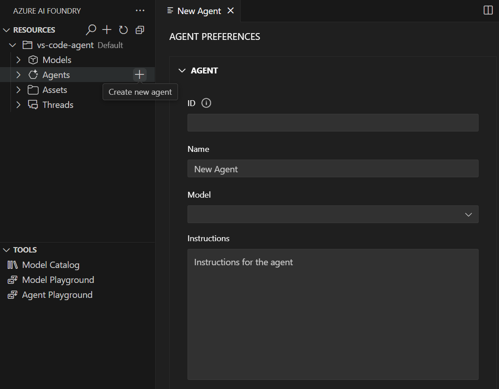

---
lab:
  title: Desenvolver um agente de IA com a extensão do VS Code
  description: Use a extensão do VS Code da Fábrica da Microsoft para criar um agente de IA.
---

# Desenvolver um agente de IA com a extensão do VS Code

Neste exercício, você usará a extensão do VS Code da Fábrica da Microsoft para criar um agente que pode usar ferramentas de servidor MCP (Protocolo de Contexto de Modelo) para acessar as APIs e fontes de dados externas. O agente poderá recuperar informações atualizadas e interagir com vários serviços por meio de ferramentas MCP.

Este exercício deve levar aproximadamente **30** minutos para ser concluído.

> **Observação**: algumas das tecnologias usadas neste exercício estão em versão prévia ou em desenvolvimento ativo. Você pode observar algum comportamento, avisos ou erros inesperados.

## Pré-requisitos

Antes de iniciar este exercício, certifique-se de ter:
- O Visual Studio Code instalado
- Uma assinatura ativa do Azure

## Instalar a extensão do VS Code da Fábrica

Vamos começar instalando e configurando a extensão do VS Code.

1. Abra o Visual Studio Code.

1. Selecione **Extensões** no painel esquerdo (ou pressione **Ctrl+Shift+X**).

1. Na barra de pesquisa, digite **Fábrica** e pressione Enter.

1. Selecione a extensão **Fábrica** da Microsoft e clique em **Instalar**.

1. Após a conclusão da instalação, verifique se a extensão aparece na barra de navegação primária no lado esquerdo do Visual Studio Code.

## Entrar no Azure e criar um projeto

Agora você se conectará aos recursos do Azure e criará um novo projeto da Fábrica de IA.

1. Na barra lateral do VS Code, selecione o ícone da extensão da **Fábrica**.

1. No modo de exibição recursos do Azure, selecione **Entrar no Azure...** e siga os prompts de autenticação.

1. Depois de entrar, selecione a assinatura do Azure na lista suspensa.

1. Crie um novo projeto da Fábrica selecionando o ícone **+** (sinal de adição) ao lado de **Recursos** no modo de exibição Extensão da Fábrica.

1. Escolha se deseja criar um novo grupo de recursos ou usar um já existente:
   
   **Para criar um grupo de recursos:**
   - Selecione **Criar grupo de recursos** e pressione Enter
   - Insira um nome para o grupo de recursos (por exemplo, "rg-ai-agents-lab") e pressione Enter
   - Selecione um local nas opções disponíveis e pressione Enter
   
   **Para usar um grupo de recursos existente:**
   - Selecione o grupo de recursos que você deseja usar na lista e pressione Enter

1. Insira um nome para o projeto da Fábrica (por exemplo, "ai-agents-project") na caixa de texto e pressione Enter.

1. Aguarde até que a implantação do projeto seja concluída. Um pop-up será exibido com a mensagem "Projeto implantado com êxito".

## Implantar um modelo

Você precisará de um modelo implantado para usar com seu agente.

1. Quando o pop-up "Projeto implantado com êxito" for exibido, selecione o botão **Implantar um modelo**. Isso abre o Catálogo de modelos.

   > **Dica**: Você também pode acessar o Catálogo de modelos selecionando o ícone **+** ao lado de **Modelos** na seção Recursos ou pressionando **F1** e executando o comando **Fábrica: Abra o Catálogo de modelos**.

1. No Catálogo de modelos, localize o modelo **gpt-4o** (você pode usar a barra de pesquisa para encontrá-lo rapidamente).

    

1. Selecione **Implantar no Azure** ao lado do modelo gpt-4o.

1. Defina as configurações de implantação:
   - **Nome da implantação**: Insira um nome como "gpt-4o-deployment"
   - **Tipo de implantação**: Selecione **Padrão Global** (ou **Padrão** se o Padrão Global não estiver disponível)
   - **Versão do modelo**: Deixar o padrão
   - **Tokens por minuto**: Deixar o padrão

1. Selecione **Implantar na Fábrica** no canto inferior esquerdo.

1. Na caixa de diálogo de confirmação, selecione **Implantar** para implantar o modelo.

1. Aguarde até que a implantação seja concluída. Seu modelo implantado será exibido na seção **Modelos** no modo de exibição Recursos.

## Criar um agente de IA com o modo de exibição do designer

Agora você criará um agente de IA usando a interface do designer visual.

1. No modo de exibição Extensão da Fábrica, localize a seção **Recursos**.

1. Selecione o ícone **+** (mais) ao lado da subseção **Agents** para criar um novo Agente de IA.

    

1. Escolha um local para salvar os arquivos do agente quando solicitado.

1. O modo de exibição do designer do agente será aberto junto com um arquivo de configuração `.yaml`.

### Configurar seu agente no designer

1. No designer de agente, configure os seguintes campos:
   - **Nome**: Insira um nome descritivo para o agente (por exemplo, "data-research-agent")
   - **Descrição**: Adicione uma descrição explicando a finalidade do agente
   - **Modelo**: Selecione sua implantação GPT-4o na lista suspensa
   - **Instruções**: Insira instruções do sistema como:
     ```
     You are an AI agent that helps users research information from various sources. Use the available tools to access up-to-date information and provide comprehensive responses based on external data sources.
     ```

1. Salve a configuração selecionando **Arquivo > Salvar** na barra de menus do VS Code.

## Adicionar uma ferramenta do Servidor MCP ao seu agente

Agora você adicionará uma ferramenta de servidor MCP (Protocolo de Contexto de Modelo) que permite que seu agente acesse APIs externas e fontes de dados.

1. Na seção **FERRAMENTA** do designer, selecione o botão **Adicionar ferramenta** no canto superior direito.


1. No menu suspenso, escolha **Servidor MCP**.

1. Configure a ferramenta do servidor MCP com as seguintes informações:
   - **URL do servidor**: Insira a URL de um servidor MCP (por exemplo, `https://gitmcp.io/Azure/azure-rest-api-specs`)
   - **Rótulo do servidor**: Insira um identificador exclusivo (por exemplo, "github_docs_server")

1. Deixe a lista suspensa **Ferramentas permitidas** vazia para permitir todas as ferramentas do servidor MCP.

1. Selecione o botão **Criar ferramenta** para adicionar a ferramenta ao agente.

## Implantar seu agente na Fábrica

1. No modo de exibição de designer, selecione o botão **Criar na Fábrica** no canto inferior esquerdo.

1. Aguarde até que a implantação seja concluída.

1. Na barra de navegação do VS Code, atualize o modo de exibição **Recursos do Azure**. O agente implantado agora deve aparecer na subseção **Agents**.

## Testar seu agente no playground

1. Clique com o botão direito do mouse no agente implantado na subseção **Agentes**.

1. Selecione **Abrir Playground** no menu de contexto.

1. O playground de agentes será aberto em uma nova guia no VS Code.

1. Digite um prompt de teste, como:

   ```output
   Can you help me find documentation about Azure Container Apps and provide an example of how to create one?
   ```

1. Envie a mensagem e observe os prompts de autenticação e aprovação para a ferramenta do Servidor MCP:
    - Para este exercício, selecione **Sem autenticação** quando solicitado.
    - Para a preferência de aprovação das Ferramentas MCP, você pode selecionar **Sempre aprovar**.

1. Examine a resposta do agente e observe como ele usa a ferramenta de servidor MCP para recuperar informações externas.

1. Verifique a seção **Anotações do agente** para ver as fontes de informações usadas pelo agente.

## Gerar código de exemplo para seu agente

1. Clique com o botão direito do mouse no agente implantado e selecione **Abrir arquivo de código** ou selecione o botão **Abrir arquivo de código** na página Preferências do agente.

1. Escolha seu SDK preferido na lista suspensa (Python, .NET, JavaScript ou Java).

1. Selecione a linguagem de programação da sua preferência.

1. Escolha o método de autenticação preferido.

1. Examine o código de exemplo gerado que demonstra como interagir com seu agente programaticamente.

Você pode usar esse código como ponto de partida para a criação de aplicativos que aproveitam seu agente de IA.

## Exibir o histórico e os threads da conversa

1. No modo de exibição **Recursos do Azure**, expanda a subseção **Threads** para ver conversas criadas durante as interações do agente.

1. Selecione um thread para exibir a página **Detalhes do thread**, que mostra:
   - Mensagens individuais na conversa
   - Executar informações e detalhes de execução
   - Respostas do agente e uso de ferramentas

1. Selecione **Exibir informações de execução** para ver informações detalhadas do JSON sobre cada execução.

## Resumo

Neste exercício, você usou a extensão da Fábrica no VS Code para criar um agente de IA com ferramentas do servidor MCP. O agente pode acessar fontes de dados externas e APIs por meio do Protocolo de Contexto de Modelo, permitindo que ele forneça informações atualizadas e interaja com vários serviços. Você também aprendeu a testar o agente no playground e gerar um código de exemplo para interação programática.

## Limpar

Quando terminar de explorar a extensão da Fábrica no VS Code, você deverá limpar os recursos para evitar incorrer em custos desnecessários do Azure.

### Excluir seus agentes

1. No portal da Fábrica, selecione **Agentes** no menu de navegação.

1. Selecione seu agente e, em seguida, selecione o botão **Excluir**.

### Excluir seus modelos

1. No VS Code, atualize o modo de exibição **Recursos do Azure**.

1. Expanda a subseção **Modelos**.

1. Clique com o botão direito do mouse no modelo implantado e selecione **Excluir**.

### Excluir outros recursos

1. Abra o [Portal do Azure](https://portal.azure.com).

1. Navegue até o grupo de recursos que contém os recursos da Fábrica de IA.

1. Selecione **Excluir grupo de recursos** e confirme a exclusão.